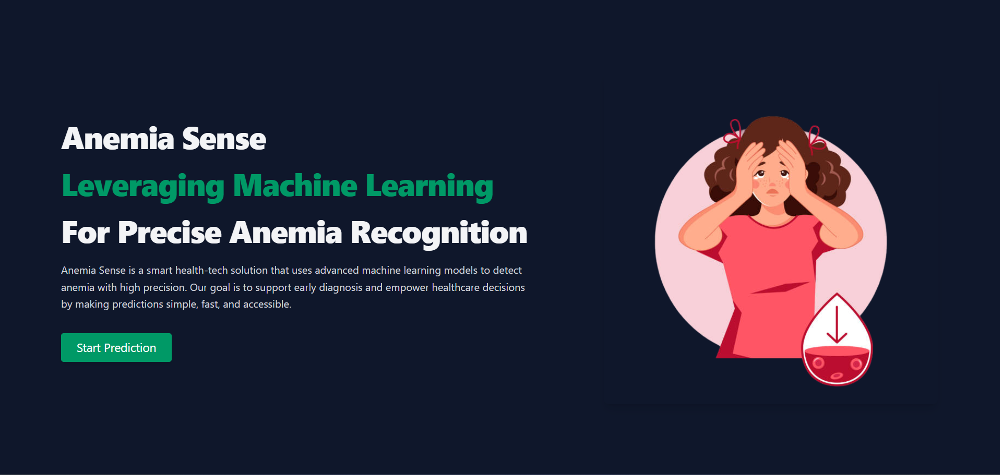
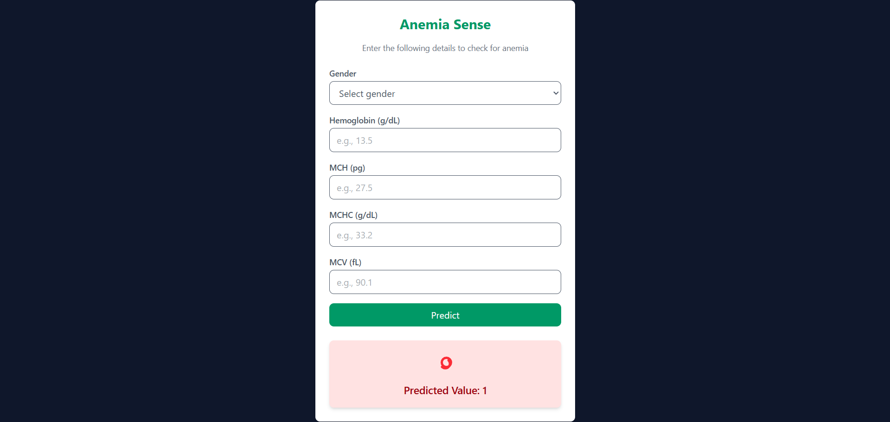

# Anemia Sense: Leveraging Machine Learning For Precise Anemia Recognition

## 📌 Overview
Anemia Sense is a machine learning-powered web application that predicts whether a person has anemia based on specific health parameters.  
The model takes input from users, processes it, and returns an accurate prediction.

---

## Screenshots

### 🏠 Home Page




---

## 🎯 Features
- **User-Friendly Interface**: Built with Tailwind CSS for a clean, responsive design.
- **Machine Learning Backend**: Flask API integrated with a trained ML model.
- **Detailed Input Fields**: Collects essential medical parameters for accurate predictions.
- **Visual Prediction Output**: Displays prediction results in an eye-catching way.

---

## 🧠 Input Features
The application requires the following inputs from the user:
1. **Gender** (Male/Female)
2. **Hemoglobin** (g/dL)
3. **MCH** (Mean Corpuscular Hemoglobin)
4. **MCHC** (Mean Corpuscular Hemoglobin Concentration)
5. **MCV** (Mean Corpuscular Volume)

---

## ⚙️ Technology Stack
- **Frontend**: HTML, Tailwind CSS
- **Backend**: Flask (Python)
- **Machine Learning**: scikit-learn / pandas / numpy
- **Deployment**: Render

---

## 🚀 Installation & Setup

### 1️⃣ Clone the Repository
```bash
git clone https://github.com/Kishan-k2004/Anemia-Sense
cd anemia-sense
```

### 2️⃣ Create Virtual Environment
```bash
conda create -n anemia-sense python=3.10
conda activate anemia-sense
```

### 3️⃣ Install Dependencies
```bash
pip install -r requirements.txt
```

### 4️⃣ Run Locally
```bash
python app.py
```
Visit `http://127.0.0.1:5000` in your browser.

---

## 🌐 Deployment (Render)
1. Push the project to GitHub.
2. Create a **Render Web Service**.
3. Add a `Procfile` with:
```
web: gunicorn app:app
```
4. Deploy.

---

## 📊 Model Training
The model was trained on a dataset containing hemoglobin, MCH, MCHC, MCV, and gender values.  
It uses classification algorithms to determine the likelihood of anemia.

---

## 📅 Project Timeline
- **Start Date**: 2025-07-20
- **Completion Date**: 2025-08-10

---

## 🤝 Contributors
- Kishan Khansali (Lead Developer & ML Engineer)

---

## 📜 License
This project is licensed under the MIT License.

---